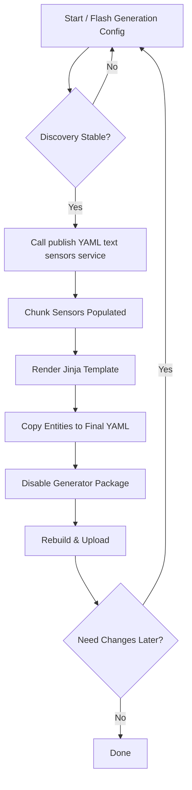

# ESPHome Component: Wavin AHC 9000 / Jablotron AC-116 (v3 restart)

Integrates the Wavin AHC 9000 (a.k.a. Jablotron AC-116) floor heating controller via its RS‑485 protocol (custom function codes 0x43 / 0x44 / 0x45). Provides auto‑discovery assisted YAML generation, single & grouped climate entities, comfort (floor‑temperature based) climates, and optional per‑channel sensors.

## Key Features

| Feature | Status | Notes |
|---------|--------|-------|
| Up to 16 channels | ✅ | Automatically discovered through staged polling |
| Single channel climates | ✅ | One climate per active channel |
| Group climates | ✅ | Channels sharing same primary element grouped; composite name logic |
| Comfort climates | ✅ | Uses floor temperature as current temp when floor probe detected |
| Battery sensors | ✅ | Per channel (0–100%) |
| Temperature sensors | ✅ | Per channel ambient temperature |
| Floor probe detection | ✅ | Auto-detects plausible floor sensor (>1°C & <90°C) |
| Friendly names per channel | ✅ | `channel_XX_friendly_name` config; used in generated YAML |
| YAML suggestion + chunk sensors | ✅ | Service driven; chunks safe for HA text sensor size limits |
| Commented single climates for grouped members | ✅ | Keeps originals (commented) for reference |
| Jinja stitching templates | ✅ | Provided (`jinjatemplate.txt` and `jinja_examples.j2`) |
| Readiness binary sensor | ✅ | Optional `yaml_ready` type |
| Robust retry & polling pacing | ✅ | 2-attempt read/write retry logic |

## Project Status / Vibe-Coding Disclaimer
This is a "vibe-coding" / fast-iteration community project:
* Reverse-engineered protocol pieces may evolve; some registers/assumptions could change as more hubs are tested.
* YAML generation format is considered stable enough for use, but minor cosmetic tweaks (indentation, naming heuristics, commenting strategy) can still occur.
* Floor/comfort logic, group naming rules, and friendly-name composition are pragmatic rather than final standards.
* Expect occasional refactors prioritizing clarity and onboarding experience over strict backward compatibility of generated suggestions.
* If you pin this as a GitHub external component for production, review diffs before updating — especially around write behaviors.

Contributions (bug reports, captures, PRs) are welcome. Please include firmware logs (DEBUG level), channel counts, and whether floor probes are present to help refine heuristics.

## Quick Start (Final Config Example)
### TL;DR Workflow
1. Flash a minimal generation config with the `yaml_generator` package enabled.
2. Wait until (optional) `yaml_ready` binary sensor = ON (or ~60s).
3. Call service: `esphome.<node>_wavin_publish_yaml_text_sensors`.
4. Open `jinjatemplate.txt` (or `jinja_examples.j2`) in HA Template editor; render combined YAML.
5. Copy generated entity blocks into your permanent node YAML.
6. Comment out the generator package include.
7. Recompile & upload clean firmware.

Flowchart (Mermaid):


Static diagram (SVG):


```yaml
external_components:
  - source: github://heinekmadsen/esphome_wavinahc9000v3
    components: [wavin_ahc9000]

uart:
  id: uart_wavin
  tx_pin: GPIO17
  rx_pin: GPIO16
  baud_rate: 38400

wavin_ahc9000:
  id: wavin
  uart_id: uart_wavin
  update_interval: 5s
  # Optional: half-duplex RS485 direction control (DE/RE). Only include ONE of these if needed.
  # flow_control_pin: GPIO4   # Preferred unified DE/RE control (driven HIGH only while transmitting)
  # tx_enable_pin: GPIO4      # Legacy always-on style driver enable (kept for compatibility)
  channel_01_friendly_name: "Bedroom"
  channel_02_friendly_name: "Living Room"
  channel_03_friendly_name: "Kitchen"

climate:
  - platform: wavin_ahc9000
    wavin_ahc9000_id: wavin
    name: "Living Room & Kitchen"
    members: [2,3]
  - platform: wavin_ahc9000
    wavin_ahc9000_id: wavin
    name: "Bedroom"
    channel: 1

sensor:
  - platform: wavin_ahc9000
    wavin_ahc9000_id: wavin
    name: "Bedroom Battery"
    channel: 1
    type: battery
  - platform: wavin_ahc9000
    wavin_ahc9000_id: wavin
    name: "Bedroom Temperature"
    channel: 1
    type: temperature
```

### Example ESPHome YAML (explicit platforms)
This variant shows a single channel, a grouped climate, plus both battery and temperature sensors explicitly defined.

```yaml
external_components:
  - source: github://heinekmadsen/esphome_wavinahc9000v3
    components: [wavin_ahc9000]

uart:
  id: uart_wavin
  tx_pin: GPIO17
  rx_pin: GPIO16
  baud_rate: 38400

wavin_ahc9000:
  id: wavin
  uart_id: uart_wavin
  update_interval: 5s
  # flow_control_pin: GPIO4  # (optional) direction control
  channel_01_friendly_name: "Bedroom"
  channel_02_friendly_name: "Living Room"
  channel_03_friendly_name: "Kitchen"

climate:
  # Group climate (channels 2 & 3). Generated YAML would comment out single 2/3 climates.
  - platform: wavin_ahc9000
    wavin_ahc9000_id: wavin
    name: "Living Room & Kitchen"
    members: [2,3]
  # Single channel climate (channel 1)
  - platform: wavin_ahc9000
    wavin_ahc9000_id: wavin
    name: "Bedroom"
    channel: 1

sensor:
  # Battery sensor for channel 1
  - platform: wavin_ahc9000
    wavin_ahc9000_id: wavin
    name: "Bedroom Battery"
    channel: 1
    type: battery
  # Ambient temperature sensor for channel 1
  - platform: wavin_ahc9000
    wavin_ahc9000_id: wavin
    name: "Bedroom Temperature"
    channel: 1
    type: temperature
```

### Comfort Climate Example
If a channel has a detected floor probe you can expose an alternative "comfort" climate that reports the floor temperature as the current temperature and also surfaces the floor min/max limits as adjustable low/high targets.

Add `use_floor_temperature: true` to a single-channel climate. You can optionally keep both the normal (air based) and comfort variant for the same physical zone (give them different names) – they will share the underlying setpoint.

```yaml
climate:
  # Standard air temperature climate
  - platform: wavin_ahc9000
    wavin_ahc9000_id: wavin
    name: "Bathroom"
    channel: 4

  # Comfort (floor-based) variant – requires a valid floor probe reading
  - platform: wavin_ahc9000
    wavin_ahc9000_id: wavin
    name: "Bathroom Comfort"
    channel: 4
    use_floor_temperature: true
```

Notes:
* The comfort climate only appears in generated YAML if the floor probe was already detected (plausible >1°C and <90°C reading). If you add it manually and the probe is not yet detected it will show as unavailable until a valid value is read.
* Low / high target temperatures correspond to the controller's floor min / max limits. Adjusting them writes those limits (clamped 5–35°C, 0.5°C steps with at least 1.0°C separation enforced).
* Action (heating/idle) logic still derives from the difference between current (floor) temperature and the setpoint with a small hysteresis.

## Hardware & Wiring
* RS‑485 (A/B) from controller to a TTL↔RS‑485 adapter.
* ESP32 recommended (tested pins 16/17 for stable UART).
* Optional direction control:
  * `flow_control_pin:` supply a single GPIO tied to DE & /RE (HIGH during TX, LOW for RX). Recommended for most MAX3485/75176 style boards.
  * `tx_enable_pin:` legacy boolean driver enable (HIGH enables, left HIGH between frames). Use only if you already wired it this way; otherwise prefer `flow_control_pin`.
* If neither is specified and your transceiver auto‑enables, you can omit both.

### Choosing flow_control_pin vs tx_enable_pin
| Option | Behavior | Pros | Cons |
|--------|----------|------|------|
| `flow_control_pin` | Pulsed HIGH only while sending, LOW for receive | Minimizes bus contention; cleaner half‑duplex | Very slightly more GPIO toggling |
| `tx_enable_pin` | HIGH enables driver (often kept HIGH) | Simple if already wired | Can hold bus driver enabled longer than needed |

Prefer `flow_control_pin` for new builds. Keep `tx_enable_pin` only for backward compatibility or where hardware expects a static enable.

## Two-Phase Workflow (Recommended)

1. Generation phase (minimal config + generator package) → see `example_generate_yaml.yaml`.
2. Final phase (copied entities, generator removed) → see `example_after_generate_yaml.yaml`.

This keeps the final runtime lean while letting the component propose accurate entities.

See `INSTALLATION.md` for a detailed, step-by-step onboarding guide (generation → stitching → final deploy) plus troubleshooting tips.

Note: climates are defined explicitly under the `climate:` section using platform `wavin_ahc9000` (single channel or grouped). Optional per-channel battery sensors use `sensor: - platform: wavin_ahc9000`.

## Friendly Names
Provide any subset of:
```yaml
wavin_ahc9000:
  channel_01_friendly_name: "Bedroom"
  channel_07_friendly_name: "Office"
```
Missing entries fallback to `Zone N`.

Group climate naming (all members have friendly names):
* 2 members: `NameA & NameB`
* 3–4 members: `NameA, NameB & NameC`
* >4 members: `FirstName – LastName`
Fallback: `Zone G a&b` or `Zone G first-last`.

Single climates that belong to a generated group are still included in the full suggestion but commented out for clarity.

## Aggregation Semantics
| Property | Group Logic |
|----------|-------------|
| Current Temperature | Average of members (or floor temp for comfort variant) |
| Setpoint | Average of member setpoints |
| Action | Heating if any member heating else idle |

## Developer / Debug Tips
* Start with one known-good channel powered & paired.
* Use `logger:` level DEBUG while validating wiring.
* Temporarily raise `poll_channels_per_cycle` to accelerate discovery, then revert.
* Floor probe detection waits for plausible readings; early YAML generation may omit comfort climates—re-run later.

## Services
| Service | Purpose |
|---------|---------|
| `wavin_generate_yaml` | Build latest suggestion internally (does not push chunks) |
| `wavin_publish_yaml_text_sensors` | Generate then publish chunk sensor states (skips if no channels yet) |
| `wavin_notify_yaml_chunks` | (Reserved / minimal) triggers generation only |
| `wavin_strict_heat` | Example: force baseline config (see source) |

Chunk sensors follow naming like `sensor.wavin_yaml_climate_1` etc. See `jinjatemplate.txt` / `jinja_examples.j2` for stitching.

## Jinja Templates
Two forms are provided:
* `jinjatemplate.txt` – annotated human-readable reference.
* `jinja_examples.j2` – syntax-highlight friendly, drop into HA template editor (remove outer comments as needed).

Copy the rendered template output into your final ESPHome YAML, adjust names, then remove the generator package.

## Floor & Comfort Climates
Comfort climates appear only for channels with a detected floor probe. Names append `Comfort` to the friendly name (or `Zone N`).

## Commented Single Climates for Group Members
When a group climate is generated, its member single-channel climates remain in the full suggestion but are commented out with an explanatory line. This keeps copy/paste flexible (just uncomment if you later decide to manage them individually).

## YAML Generator Workflow Overview

This component can generate suggested YAML for discovered channels. Because Home Assistant limits text sensor sizes, the suggestion is also exposed as chunked text sensors (each containing only entity blocks, without section headers). Use the included `jinjatemplate.txt` to stitch them back together.

### Enabling the Generator

Files involved:
- `packages/yaml_generator.on.yaml`  (full set of text sensors + services)
- `packages/yaml_generator.off.yaml` (empty stub – mostly for clarity)
- `packages/yaml_generator.yaml`     (documentation only)

In your node YAML add (uncomment while needed):

```yaml
packages:
  # Enable during onboarding to generate YAML suggestions
  yaml_generator: !include packages/yaml_generator.on.yaml
  # Optional: debug register dump service
  # wavin_debug: !include packages/wavin_debug_services.yaml
```

After you've copied the generated YAML into your permanent config, simply comment the `yaml_generator` line again to remove the helper entities and services.

### Generating & Collecting the YAML
1. Recompile & upload with the generator enabled.
2. In Home Assistant call the service: `esphome.<node_name>_wavin_publish_yaml_text_sensors` (or first `wavin_generate_yaml`).
3. Inspect sensors:
   - `sensor.wavin_yaml_climate_1` .. `sensor.wavin_yaml_climate_8`
   - `sensor.wavin_yaml_comfort_climate_1` .. (if comfort climates apply)
   - `sensor.wavin_yaml_temperature_1` .. `sensor.wavin_yaml_temperature_8`
   - `sensor.wavin_yaml_battery_1` .. `sensor.wavin_yaml_battery_8`
   - `sensor.wavin_yaml_floor_temperature_1` .. (only if floor probes detected)
4. Optionally view the single full suggestion sensor: `sensor.wavin_yaml_suggestion` (may be truncated for very large outputs in HA – use chunks when in doubt).
5. Open `jinjatemplate.txt` and use the “All-in-one” Jinja macro to stitch chunks back into a cohesive YAML block (adds section headers + indentation).

### Why Not a Substitution Toggle?
Early versions used a substitution (`YAML_GEN_STATE`) to switch between on/off files. Remote GitHub package includes cannot use substitutions in the `files:` list, leading to confusion. The project now favors a simple comment/uncomment pattern for reliability both locally and in remote includes.

### Floor Probe Driven Additions / Comfort
If at least one floor probe is plausibly detected (>1.0°C and <90°C after startup), the generator adds the relevant floor temperature sensor entries. If you trigger the service very early and they are missing, trigger again later.

### Readiness Indicator
You can optionally add a `yaml_ready` binary sensor to know when discovery has progressed enough to get stable YAML suggestions:

```yaml
binary_sensor:
  - platform: wavin_ahc9000
    wavin_ahc9000_id: wavin
    type: yaml_ready
    name: "Wavin YAML Ready"
```

Once you have migrated the suggested YAML entities you want, disable the generator include to declutter.

### Comfort Setpoint (Read-Only) Sensor

If you do not want writable number entities but still want to surface the current comfort (manual) setpoint as a sensor for dashboards or historical graphs, you can add a `comfort_setpoint` sensor type:

```yaml
sensor:
  - platform: wavin_ahc9000
    wavin_ahc9000_id: wavin
    channel: 3
    type: comfort_setpoint
    name: "Zone 3 Comfort Setpoint"
```

This sensor publishes the latest manual/comfort setpoint (register 0x00) that the integration already reads for the climate entity. It is read-only; changing it requires using the climate entity or a number entity if enabled in another branch.

### Floor Temperature Sensor

If your thermostat provides a floor probe value, you can expose it separately:

```yaml
sensor:
  - platform: wavin_ahc9000
    wavin_ahc9000_id: wavin
    channel: 3
    type: floor_temperature
    name: "Zone 3 Floor Temperature"
```

This reads element index 0x05 (same scaling as air). A plausibility filter (>1..90°C) is applied; invalid or missing values result in the sensor staying unavailable.

Automatic detection: The component now marks a channel as having a floor sensor only after at least one plausible, non-zero floor reading is observed (> 1.0°C and < 90°C). Until then, any configured `floor_temperature` sensor will remain unavailable (rather than showing 0.0). The YAML generation services (`_wavin_generate_yaml` / `_wavin_publish_yaml_text_sensors`) will include floor temperature sensor entity suggestions only for channels where a valid floor probe has already been detected. If you generate YAML immediately after boot and a floor probe wasn’t yet detected, just trigger the service again later after some polling cycles.

Chunked YAML: If at least one floor probe is detected, an additional chunk set is exposed via the `get_yaml_floor_temperature_chunk` API internally (usable in future text sensors). If you add corresponding text sensors (e.g. `wavin_yaml_floor_temperature_1..8`), you can stitch them with the same Jinja approach as other sensor chunks by adding an extra `sensor:` header and their content.

### YAML Readiness Indicator (binary_sensor)

To know when it's reasonable to generate and copy the suggested YAML, a readiness indicator is exposed as a binary sensor. It turns on once the hub has:
- Discovered at least one active channel (primary element present and no TP lost)
- Completed at least one full element block read for all discovered channels

Add this to your config if desired:

```yaml
binary_sensor:
  - platform: wavin_ahc9000
    wavin_ahc9000_id: wavin
    type: yaml_ready
    name: "Wavin YAML Ready"
```

## Future Ideas
* Optional toggle to suppress (instead of comment) grouped member single climates in generated YAML.
* Additional diagnostics (timing stats, packet counters) exposed via sensors.
* Entity category refinement for sensors (diagnostic vs primary).

## Disclaimer
Community-driven integration; use at your own risk. Not affiliated with Wavin / Jablotron.